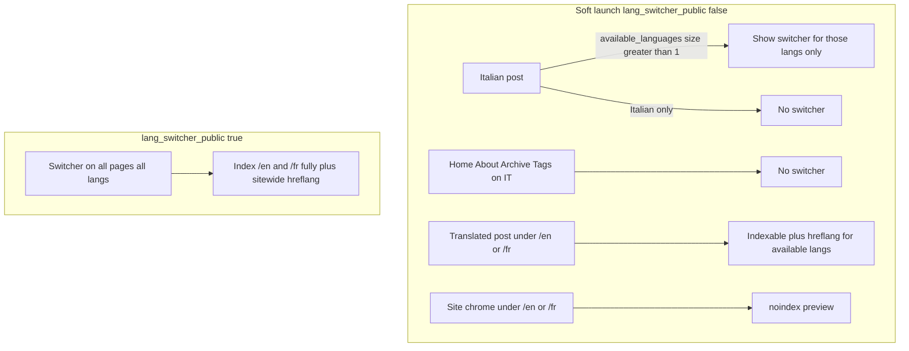

# Selective translation soft launch

**Parent:** [sveltia-cms.md](./sveltia-cms.md)  
**Status:** Next (not implemented yet)

Change soft launch from a global on/off language switcher to per-post visibility: Italian pages show IT/EN/FR only when that article has real translations; site chrome stays gated by `lang_switcher_public` until a full announcement.

## Todos

- [ ] Per-post switcher visibility in `_includes/lang-switcher.html`
- [ ] Narrow `preview_lang` so translated posts are indexable
- [ ] Emit hreflang for available post langs during soft launch
- [ ] Update `_config.yml` + README soft-launch wording

## Current behavior (all or nothing)

`lang_switcher_public: false` in `_config.yml` hides the switcher on **all** Italian pages. `/en/` and `/fr/` stay `noindex`, and hreflang is withheld site-wide. Author preview: open `/en/…` directly. Flipping the flag to `true` announces **everything** at once.

Posts already know their real locales via polyglot `page.available_languages` (and `_plugins/strip_post_fallbacks.rb` keeps missing translations from appearing under `/en`/`/fr`).

## New behavior

- **Posts:** If `available_languages` has more than one locale, show the switcher on the Italian URL too (only those langs). Emit `hreflang` / `og:locale:alternate` for **those** langs only. Do **not** `noindex` those translated post URLs.
- **Italian-only posts:** No switcher (unchanged feel).
- **Site chrome** (home, about, archive, tags, 404, etc.): Still hidden on Italian while soft launch; `/en`/`/fr` chrome stays `noindex` until `lang_switcher_public: true`.
- **Full announce:** `lang_switcher_public: true` still means switcher everywhere + index all prefixed URLs + full hreflang (as today).

## Author point of view

She does not flip a site-wide “translations on” switch for each article. **Publishing a translation = adding that language’s file** (CMS locale tab or `.en.md` / `.fr.md`). After the site rebuilds:

1. **Italian-only article** (e.g. Magellano, Pacification)  
   Opens like today: Italian URL, **no** IT/EN/FR buttons. Readers never see a dead language choice.

2. **She adds English** (and/or French) for one piece  
   On that article’s Italian page, the switcher appears with **only the languages that exist** (e.g. IT | EN). Readers can open the real English text. Google can index that English URL. Other articles stay Italian-only.

3. **Home / Chi sono / Archivio / Tag** (Italian)  
   Still **no** language buttons during soft launch — the site does not look “fully multilingual” in the chrome. She can still preview `/en/about.html` herself; those chrome pages stay quietly `noindex` until a full announce.

4. **When the whole site is ready** (UI copy, enough articles, comfort)  
   Someone sets `lang_switcher_public: true` once. Then every page can show the switcher and `/en` `/fr` site sections are treated as public.

**Mental model for her:** “Translate this article when it’s ready → readers get the buttons on **that** article.” Not: “Wait until everything is translated, then reveal all languages.”

**CMS angle (unchanged):** open the post → add locale EN/FR → fill fields → save. No extra “publish translation” flag in the CMS; the file’s existence is the flag.

## Implementation

### 1. `_includes/lang-switcher.html`

Replace the gate `lang_switcher_public or active != default` with:

- Resolve `switcher_langs` as today (posts → `available_languages`; else → `site.languages`).
- **Show** the nav when:
  - `lang_switcher_public`, **or**
  - `active_lang != default` (preview on `/en`/`/fr`), **or**
  - post with `switcher_langs.size > 1` (selected public translations).
- Still render only langs in `switcher_langs`.

### 2. `_includes/locale.html`

Narrow `preview_lang` (drives `noindex` in `_includes/head.html`):

- Keep `preview_lang` for soft-launch **non-post** pages under `/en`/`/fr`.
- For **posts**, do not set `preview_lang` (translated articles are meant to be public when the file exists).

### 3. `_includes/SEO.html`

- For **posts** with multiple `available_languages`: emit `hreflang` (and og locale alternates) for those langs only, even when soft launch is on. Do not link langs that are not available.
- For non-posts: keep current behavior (only when `lang_switcher_public`).

### 4. Comments / copy

- Update comments in `_config.yml` (soft-launch blurb).
- Update the soft-launch paragraph in `README.md` (anteprima / when to flip the flag) so authors know: add `.en.md`/`.fr.md` → that article’s switcher appears on Italian; flip `lang_switcher_public` only when ready to present the whole multilingual site chrome.

No CMS/`admin` changes required; publishing a translation remains “add the locale file.”

## Verify

- Italian-only post (e.g. Pacification): no switcher on IT.
- Post with triad (e.g. Dahomey): switcher on IT with IT/EN/FR; `/en/Dahomey.html` has no `noindex`; hreflang lists three URLs.
- `/about.html`: no switcher while soft launch; `/en/about.html` has switcher + `noindex`.
- Set `lang_switcher_public: true` locally once to confirm full announce still works (optional smoke).
