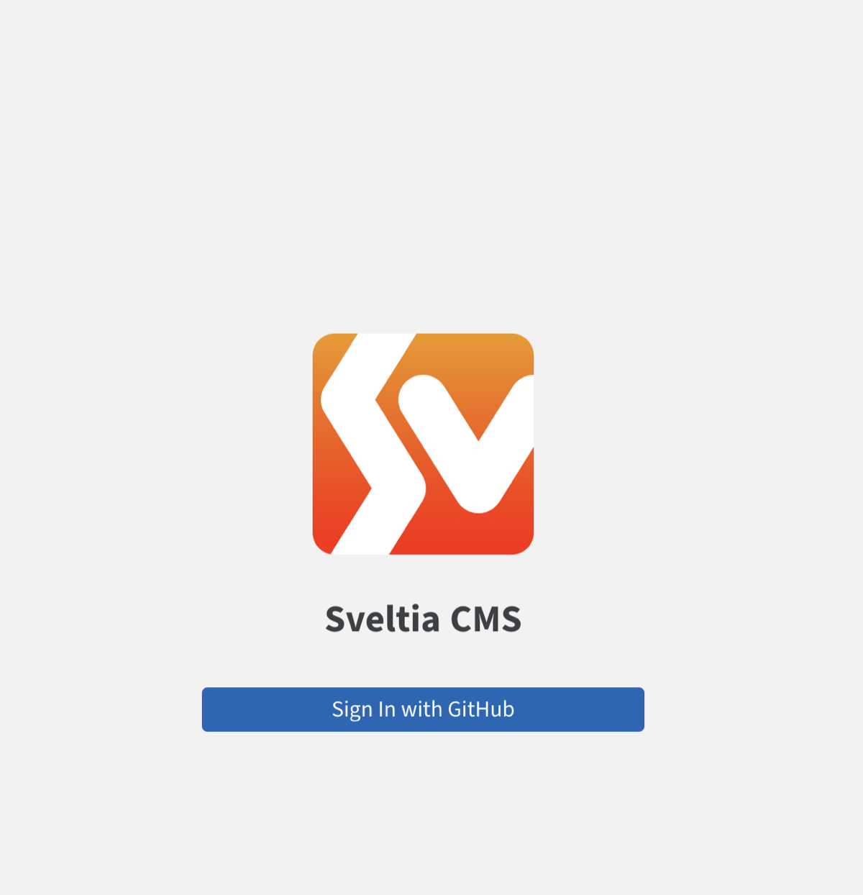
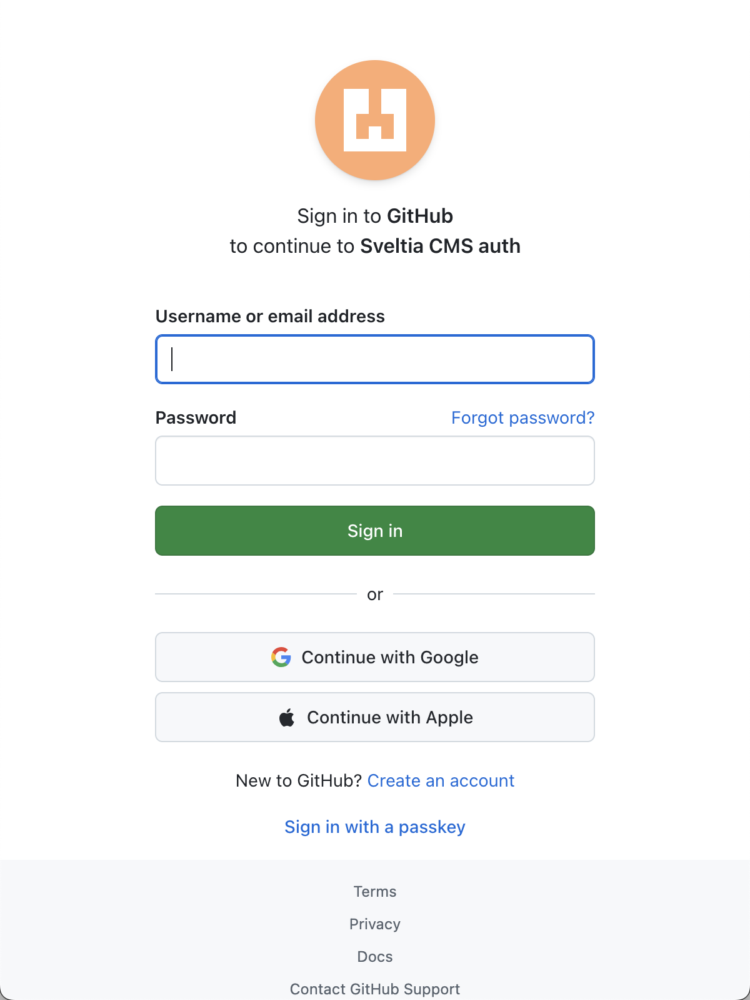
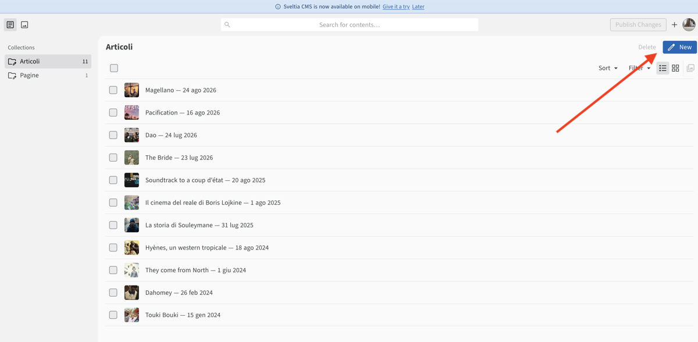
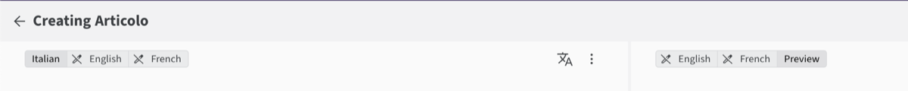
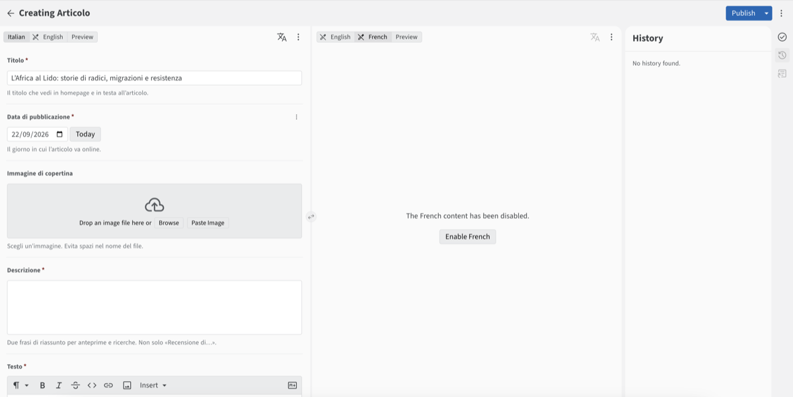
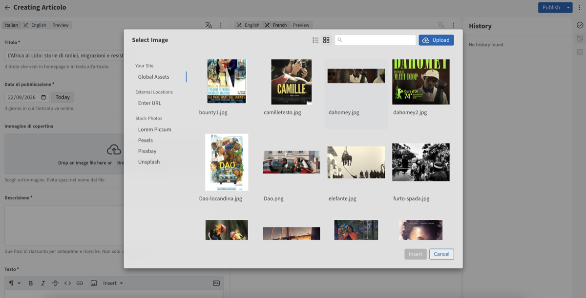
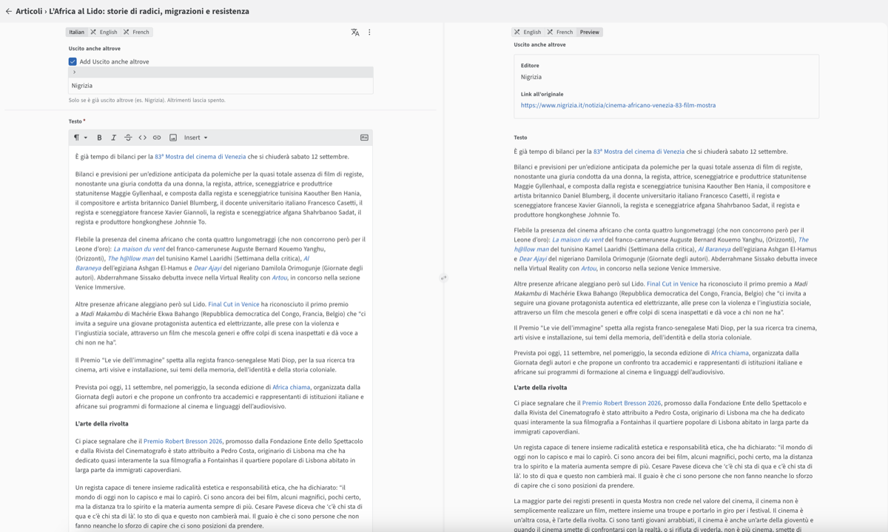
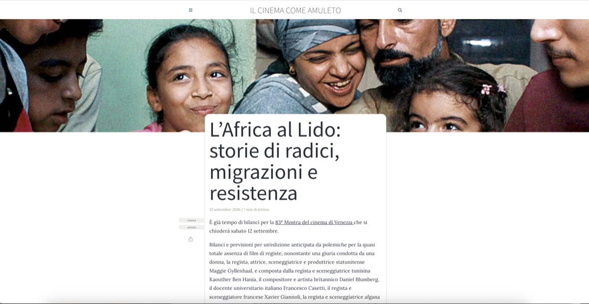

# Pubblicare un articolo (senza aprire i file)

Sito: https://simonacella.github.io/

Finora gli articoli passavano dall’editor di file di GitHub: cartelle, YAML, percorsi delle immagini. Funzionava, ma era scomodo.

Ora c’è un modulo in `/admin`. Stesso sito, stesso account GitHub — compili i campi e premi **Publish**. Qui sotto c’è **un** esempio concreto: ripubblicare sul sito [L’Africa al Lido…](https://www.nigrizia.it/notizia/cinema-africano-venezia-83-film-mostra) (già uscito su Nigrizia).

Apri: **https://simonacella.github.io/admin/**

---

## 1. Accedi

Arrivi a una pagina di accesso. Clicca **Sign in with GitHub**.

## 2. Accedi a GitHub

Si apre GitHub: inserisci le tue credenziali (o continua se sei già collegata). È lo stesso account con cui lavori già sul sito — non è programmazione, è solo «sì, sono io».

## 3. Sei dentro: Articoli

Compare l’elenco degli articoli. Sono gli stessi pezzi di sempre — solo che ora li apri come moduli, non come file. Clicca **New** (freccia rossa) per un nuovo pezzo.

## 4. Due colonne (non farti confondere)

L’editor ha **due riquadri affiancati**, ciascuno con le proprie linguette:

- **Sinistra** — dove scrivi (qui: Italian). English / French servono quando traduci.
- **Destra** — di solito **Preview** (anteprima). Puoi anche aprirci un’altra lingua per confrontare.

Non sono due articoli diversi: è lo stesso pezzo, visto da due lati.

## 5. Compila il modulo

In ordine, a sinistra:

- **Titolo** — es. *L’Africa al Lido: storie di radici, migrazioni e resistenza*
- **Data di pubblicazione** — il giorno in cui va online *sul tuo sito* (non la data Nigrizia, se diversa)
- **Immagine di copertina** — scegli un’immagine (evita spazi nel nome del file)
- **Descrizione** — due frasi di riassunto
- **Tag** — sempre in italiano (es. `cinema`, `venezia`)
- **Uscito anche altrove** (se serve) — Editore `Nigrizia`, Link = URL del pezzo

## 6. Media (copertina e immagini)

Per la **copertina** (e più avanti per le immagini nel testo) si apre la finestra **Select Image**: scegli un file già sul sito oppure **Upload** per caricarne uno nuovo. Evita spazi nel nome del file.

## 7. Testo (e video)

Scrivi in **Testo**. Basta un paragrafo o due per iniziare.

- Immagini nel corpo: pulsante **Immagine** (stessa finestra della sezione 6)
- Video: **Inserisci → YouTube** (incolla il link del video)

Poi premi **Publish** in alto a destra. Il sito si aggiorna da solo (ci vogliono uno o due minuti).

## 8. Online

Apri https://simonacella.github.io/ e cerca il titolo. L’articolo è pubblico.

---

## Poi

Lo stesso percorso vale per ogni nuovo pezzo italiano. Traduzioni e «Chi sono» arriveranno in una guida successiva.

Se proprio ti serve toccare i file a mano (contatti, titolo del sito, YAML): [GUIDA-FILE.md](./GUIDA-FILE.md).
